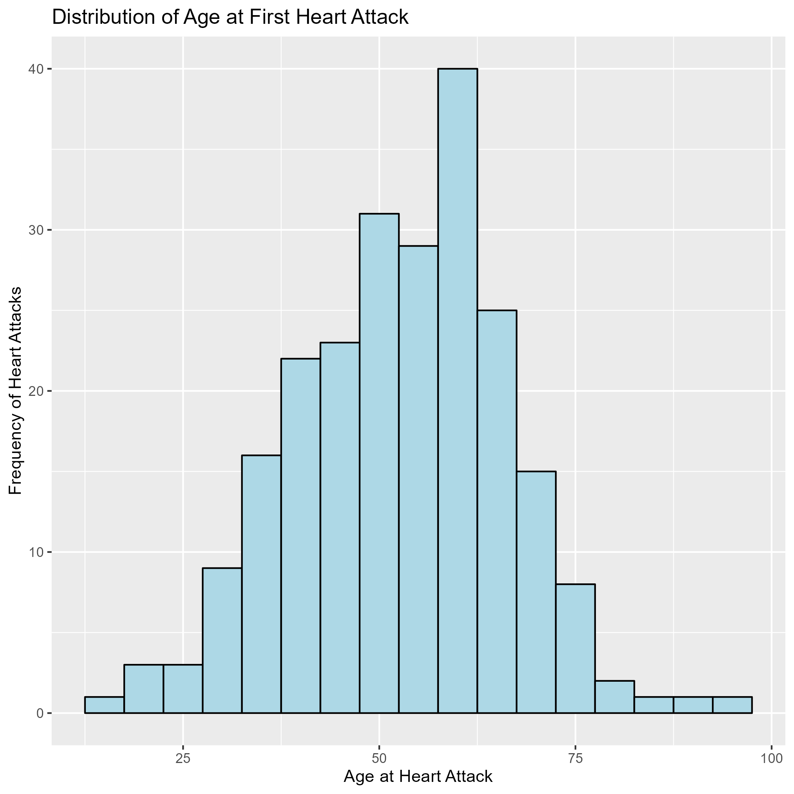

```{r, set-chunk-opts, echo = FALSE}
library(knitr)
opts_chunk$set(
  echo = FALSE, warning = FALSE, message = FALSE
)
```

```{r, here-i-am}
here::i_am("maria_report.Rmd")
```

## Introduction

Heart disease is the leading cause of death for men in the United States. Every year, about 805,000 people in the United States have a heart attack. Of these, 605,000 are first heart attacks, and 200,000 happen to people who have already had a heart attack1. The average age at the first heart attack is 65.6 years for males2. Approximately every 40 seconds, someone in the United States will have a myocardial infarction.

The analyzed dataset comes from the Panel Study of Income Dynamics (PSID) conducted by the Michigan Institute for Social Research. The PSID is the longest-running longitudinal household survey in the world. It began in 1968 with a nationally representative sample of over 18,000 individuals living in 5,000 families in the United States. Information has been continuously collected on these individuals and their descendants, covering a wide range of topics including employment, income, wealth, expenditures, health, marriage, childbearing, child development, philanthropy, and education.

For this project, I will be analyzing a sample of males who have been tracked since 1999 and still remain in the survey until 2021. This sample specifically includes males who identified as the reference or head of their household and have experienced a heart attack. Key variables in the analysis will include: history of heart disease, age at heart attack, family income level, education level, diagnosis of diabetes, hypertension, stroke events, and psychiatric conditions, such as depression.

### Objectives:

* Descriptive Statistics
* Analyze the age distribution at which these males experienced their first heart attack.
* Examine the distribution of family income levels among males who have experienced a heart attack.


## Descriptive Statistics


```{r descriptive-stats, echo=FALSE}

summary_table <- readRDS("output/table1.rds")
summary_table
```

The table above provides descriptive statistics for selected variables in the dataset, including comparisons between different age groups.The total sample was male identified as the head of the households (230) who reported a heart attack. 72% were identified as married while the other 28% were identified as never married, widowed, divorced or separated. The mean age of first heart attack was 54 years old. 31% of the individuals reported an anual income between %50-$100k, males of >65 years old were identified as the ones who receive this income (32%). In Education Level 54% of the individual receive below college education which 76% are in the group of 35-44 years old. 

## Figure 1. Distribution of Age at First Heart Attack

```{r fig-one, echo=FALSE}

```

The figure above illustrates the distribution of ages at which the males in the dataset experienced their first heart attack. The mean age of first heart attack was 54 years old (43-60 years old).


